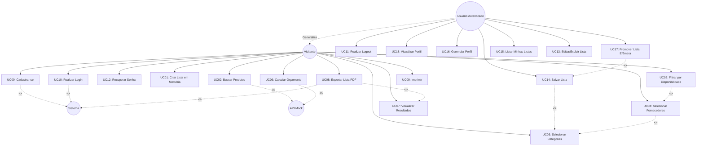
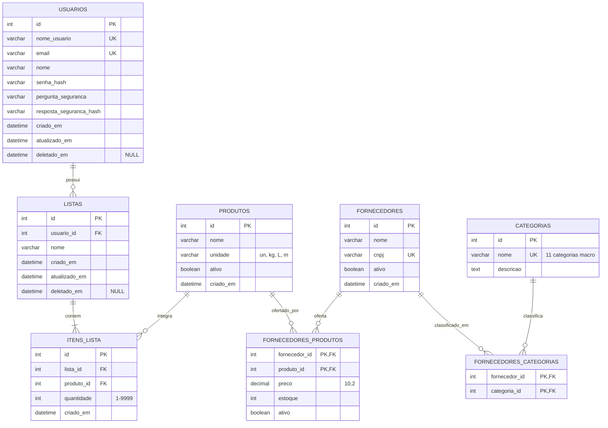

Aqui está o documento completo, estruturado e redigido em linguagem acadêmica formal, pronto para ser copiado para um editor de texto (Word, Google Docs ou LaTeX) e formatado conforme as normas da ABNT (margens: superior/esquerda 3cm, inferior/direita 2cm; fonte Arial ou Times New Roman 12; espaçamento 1,5).

Incluí representações em **Mermaid** para os diagramas. Você pode copiar o código do Mermaid e colar no [Mermaid Live Editor](https://mermaid.live) ou no [Draw.io](https://app.diagrams.net) (via *Arrange > Insert > Advanced > Mermaid*) para gerar as imagens em alta resolução e inseri-las no PDF final.

---

# [CAPA]

**FACULDADE DE TECNOLOGIA (FATEC)**  
*Curso Superior de Tecnologia em [Nome do Seu Curso, ex: Desenvolvimento de Software Multiplataforma]*

    

**LEONARDO SETTI**  
**FABRÍCIO CABRAL**  
**NICHOLAS ANTHONY**  
**EDUARDO PASSARELLI**  
**NICOLAS MALLOUK**

      

**COBECO: COTAÇÃO DE BENS DE CONSUMO**  
*Documentação do Projeto MVP*

        

**[CIDADE - SP]**  
**2026**

---

# [FOLHA DE ROSTO]

**LEONARDO SETTI**  
**FABRÍCIO CABRAL**  
**NICHOLAS ANTHONY**  
**EDUARDO PASSARELLI**  
**NICOLAS MALLOUK**

   

**COBECO: COTAÇÃO DE BENS DE CONSUMO**  
*Documentação do Projeto MVP*

  

Trabalho acadêmico apresentado à disciplina de [Nome da Disciplina], do Curso Superior de Tecnologia em [Nome do Curso] da Faculdade de Tecnologia (FATEC), como requisito parcial para avaliação da macro-fase de documentação do projeto.

**Orientadora/Professora:** Thais Cristina Casagrande

   

**[CIDADE - SP]**  
**2026**

---

# SUMÁRIO

1. [OBJETIVO DO PROJETO](#1-objetivo-do-projeto)
2. [ESCOPO](#2-escopo)
3. [REQUISITOS](#3-requisitos)
   3.1. [Requisitos Funcionais](#31-requisitos-funcionais)
   3.2. [Requisitos Não Funcionais](#32-requisitos-não-funcionais)
   3.3. [Requisitos Desejáveis](#33-requisitos-desejáveis)
4. [MODELAGEM DO SISTEMA](#4-modelagem-do-sistema)
   4.1. [Diagrama de Caso de Uso](#41-diagrama-de-caso-de-uso)
   4.2. [Diagrama Entidade-Relacionamento (DER)](#42-diagrama-entidade-relacionamento-der)
5. [PROTOTIPAGEM](#5-prototipagem)
   5.1. [Protótipo de Baixa Fidelidade](#51-protótipo-de-baixa-fidelidade)
   5.2. [Protótipo de Alta Fidelidade](#52-protótipo-de-alta-fidelidade)
6. [TECNOLOGIAS UTILIZADAS](#6-tecnologias-utilizadas)
7. [CONSIDERAÇÕES FINAIS](#7-considerações-finais)
8. [REFERÊNCIAS](#8-referências)

---

# 1. OBJETIVO DO PROJETO

O projeto COBECO (Cotação de Bens de Consumo) tem como objetivo desenvolver uma aplicação web *desktop-first* para a comparação inteligente de preços de listas de compras entre diferentes fornecedores mockados. O sistema visa otimizar o processo de decisão de compra, permitindo que usuários (autenticados ou não) criem listas de itens, pré-filtrem fornecedores por categorias macro, visualizem uma tabela comparativa flat (itens disponíveis, ausentes e preço total) e exportem o resultado em formato PDF. O projeto segue uma abordagem acadêmica de MVP (Minimum Viable Product), com prazo de execução de 30 dias, priorizando a aplicação rigorosa de conceitos de Engenharia de Software, como Clean Architecture, Specification-Driven Development (SDD) e princípios ACID.

# 2. ESCOPO

O escopo do MVP foi delimitado para garantir a entregabilidade em 30 dias, focando nas funcionalidades essenciais de valor:

**Incluído no Escopo (MVP):**
*   **Dualidade de Sessão:** Gerenciamento de listas efêmeras (armazenadas em `sessionStorage` para visitantes) e listas persistentes (armazenadas em banco de dados relacional para usuários autenticados), com fluxo de "promoção" da lista efêmera no momento do login.
*   **Pré-filtro Inteligente:** Seleção de categorias macro (ex: Mercado, Informática, Vestuário) que filtram dinamicamente a lista de fornecedores disponíveis antes da comparação.
*   **Motor de Comparação:** Geração de tabela flat ordenada por preço, com slider de filtragem por disponibilidade (0-100%) e destaque visual da melhor oferta.
*   **Exportação:** Geração de documento PDF formatado em A4 no lado do servidor (*server-side*) e otimização de CSS para impressão nativa do navegador.
*   **Autenticação Segura:** Cadastro, login com JWT (Access Token em memória + Refresh Token em cookie `httpOnly`), logout e recuperação de senha via pergunta de segurança.

**Fora do Escopo (Pós-MVP):**
*   Aplicativo mobile responsivo (o sistema é *desktop-only*, ≥1024px).
*   Integração via *web scraping* em tempo real com sites de fornecedores reais.
*   Persistência do histórico de comparações (apenas as listas de compras são persistidas).
*   Envio de e-mails reais para recuperação de senha (substituído por token em log ou pergunta de segurança).

# 3. REQUISITOS

## 3.1. Requisitos Funcionais (RF)
| ID | Descrição | Prioridade |
| :--- | :--- | :---: |
| **RF01** | O sistema deve permitir o cadastro de usuário com nome de usuário único, e-mail, senha (com regras de complexidade) e pergunta de segurança. | P0 |
| **RF02** | O sistema deve autenticar o usuário via nome de usuário e senha, implementando bloqueio (*lockout*) de 15 minutos após 6 tentativas falhas. | P0 |
| **RF03** | O sistema deve permitir o encerramento da sessão ativa, invalidando os tokens de acesso. | P0 |
| **RF04** | O sistema deve permitir a recuperação de senha através da validação da pergunta de segurança cadastrada. | P1 |
| **RF05** | O sistema deve exibir os dados pessoais do usuário autenticado (nome de usuário, e-mail, nome completo). | P1 |
| **RF06** | O sistema deve permitir a alteração de e-mail, nome e senha, exigindo a confirmação da senha atual. | P1 |
| **RF07** | O sistema deve permitir a criação de uma lista de compras em memória, com nome e itens (produto + quantidade), validando a existência do produto via *autocomplete*. | P0 |
| **RF08** | O sistema deve persistir a lista de compras no banco de dados, exigindo autenticação e validando as categorias pré-selecionadas. | P0 |
| **RF09** | O sistema deve listar as listas salvas do usuário, com paginação (20 por página) e ordenação por data de criação decrescente. | P0 |
| **RF10** | O sistema deve permitir a edição do nome e dos itens de uma lista salva, validando a propriedade do usuário. | P1 |
| **RF11** | O sistema deve permitir a exclusão lógica (*soft delete*) de uma lista salva, mediante confirmação explícita. | P1 |
| **RF12** | O sistema deve permitir a seleção de uma ou mais categorias macro para filtrar dinamicamente os fornecedores disponíveis. | P0 |
| **RF13** | O sistema deve permitir a seleção de no mínimo dois fornecedores (entre os filtrados por categoria) para comparação. | P0 |
| **RF14** | O sistema deve oferecer um controle deslizante (*slider*) de 0% a 100% para filtrar fornecedores por porcentagem de disponibilidade dos itens da lista. | P1 |
| **RF15** | O sistema deve calcular e gerar uma tabela comparativa flat, exibindo itens disponíveis, ausentes e o preço total, ordenada pelo menor preço. | P0 |
| **RF16** | O sistema deve destacar visualmente a melhor oferta (menor preço) e fornecer *tooltips* para itens ausentes. | P0 |
| **RF17** | O sistema deve gerar e permitir o download de um arquivo PDF da lista comparativa, funcional para usuários autenticados e visitantes. | P0 |
| **RF18** | O sistema deve oferecer uma visualização otimizada para impressão nativa do navegador (Ctrl+P), ocultando elementos de navegação. | P1 |

## 3.2. Requisitos Não Funcionais (RNF)
| ID | Descrição | Métrica / Critério de Aceite |
| :--- | :--- | :--- |
| **RNF01** | **Clean Architecture:** O código deve ser organizado em 4 camadas ortogonais: Domain, UseCase, Adapter e Framework. | Validação via Code Review. |
| **RNF02** | **SDD (Specification-Driven Development):** O contrato da API (OpenAPI 3.0) deve ser definido antes da implementação do código. | Endpoint `/docs` acessível e completo. |
| **RNF03** | **ACID:** O banco de dados deve garantir transações explícitas e integridade referencial. | Engine InnoDB, zero dados órfãos em testes. |
| **RNF04** | **Desktop-Only:** O layout deve ser exclusivo para telas com largura mínima de 1024px. | Breakpoint único, sem adaptação mobile. |
| **RNF05** | **Feedback Visual:** O sistema deve fornecer retorno imediato ao usuário (toasts, estados de carregamento). | Feedback visual em <100ms. |
| **RNF06** | **Testes Unitários:** A lógica de negócio deve possuir cobertura mínima de testes. | Cobertura ≥80% (verificado via `pytest --cov`). |
| **RNF07** | **CI/CD e Containerização:** O projeto deve ser executável via Docker Compose. | Pipeline de CI em <5min; `docker compose up` funcional. |
| **RNF08** | **Seed de Dados:** O banco deve ser populado automaticamente para testes e demonstração. | 10 fornecedores, 50 produtos, 11 categorias em <10s. |
| **RNF09** | **Performance:** As respostas da API devem ser otimizadas. | Latência p95 < 500ms. |
| **RNF10** | **Segurança:** Proteção contra força bruta e vazamento de dados sensíveis. | Rate limiting (6 req/15min), hash bcrypt, JWT seguro. |
| **RNF11** | **Geração de PDF:** A geração do documento deve ser eficiente. | Geração em <5s para listas de até 100 itens. |
| **RNF12** | **Padronização:** O banco de dados deve utilizar codificação de caracteres completa. | MySQL InnoDB com `utf8mb4` e `utf8mb4_unicode_ci`. |

## 3.3. Requisitos Desejáveis (Backlog Pós-MVP)
*   **RD01:** Histórico persistente de comparações realizadas.
*   **RD02:** Importação de listas de compras via upload de arquivo CSV.
*   **RD03:** Sistema de alertas/notificações para queda de preço de produtos monitorados.
*   **RD04:** Geração de link público para compartilhamento de listas de compras.
*   **RD05:** Versão responsiva da aplicação para dispositivos móveis (PWA).

# 4. MODELAGEM DO SISTEMA

## 4.1. Diagrama de Caso de Uso
O sistema possui 4 atores: **Visitante**, **Usuário Autenticado** (que generaliza o Visitante), **Sistema** e **API Mock de Fornecedores**. Abaixo está a representação estrutural dos 19 casos de uso principais e suas relações.

*(Instrução: Copie o código abaixo e cole em https://mermaid.live para gerar a imagem do diagrama e inseri-la no documento)*

## 4.2. Diagrama Entidade-Relacionamento (DER)
O modelo de dados consiste em 8 tabelas normalizadas em PT-BR, utilizando a engine InnoDB para garantir as propriedades ACID. A relação entre fornecedores e categorias é N:N, resolvida por uma tabela pivô.

*(Instrução: Copie o código abaixo e cole em https://mermaid.live para gerar a imagem do DER)*

# 5. PROTOTIPAGEM

## 5.1. Protótipo de Baixa Fidelidade
Os protótipos de baixa fidelidade (wireframes) foram estruturados para validar o fluxo de navegação e a disposição dos elementos, focando em 6 telas principais:
1. **Tela Inicial / Pré-filtro:** Checkboxes com as 11 categorias macro e botão "Continuar".
2. **Criação de Lista:** Campo de nome da lista, campo de busca com *autocomplete* de produtos, lista de itens adicionados com subtotal em tempo real e botão "Salvar" ou "Comparar".
3. **Seleção de Fornecedores:** Lista de fornecedores filtrados pelas categorias, exibindo nome e % de disponibilidade, com checkboxes e slider de filtragem (0-100%).
4. **Resultados da Comparação:** Tabela flat com colunas para cada fornecedor, linhas para cada produto, destaque em verde na célula de menor preço e indicador "N/D" para itens ausentes.
5. **Dashboard (Minhas Listas):** Tabela paginada com as listas salvas, data, quantidade de itens e ações de editar/excluir.
6. **Perfil do Usuário:** Formulário com dados cadastrais e opções de alteração de e-mail/senha.

## 5.2. Protótipo de Alta Fidelidade
O protótipo de alta fidelidade seguirá um *Design System* minimalista e profissional, implementado via **Tailwind CSS** (via CDN), garantindo consistência visual e rapidez no desenvolvimento:
*   **Paleta de Cores:** Fundo principal em cinza claro (`bg-gray-50`), cartões em branco (`bg-white`), cor primária de ação em azul institucional (`bg-blue-600`), e cor de destaque para a melhor oferta em verde (`text-green-600`, `bg-green-50`).
*   **Tipografia:** Fonte sans-serif padrão do sistema (Inter/Roboto), com tamanhos escalonados (ex: `text-2xl font-bold` para títulos de tela, `text-sm text-gray-500` para metadados).
*   **Componentes de Feedback:** Modais centralizados com *backdrop* escurecido para confirmações críticas (ex: exclusão de lista, promoção de lista efêmera) e *toasts* no canto superior direito para notificações de sucesso/erro.
*   **Impressão:** Regras CSS `@media print` definidas para ocultar cabeçalhos, botões e navegação, garantindo que a tabela de comparação seja impressa em formato A4, com quebras de página controladas e repetição de cabeçalho de tabela.

# 6. TECNOLOGIAS UTILIZADAS

Em comum acordo e alinhado aos princípios KISS (*Keep It Simple, Stupid*) e YAGNI (*You Aren't Gonna Need It*), a stack tecnológica definitiva do projeto é:

*   **Frontend:** HTML5, CSS3, Tailwind CSS (via CDN) e Vanilla JavaScript com ES6 Modules. *Justificativa:* Elimina a complexidade de *build steps* (Webpack/Vite) e *frameworks* pesados (React/Angular), maximizando o aprendizado dos fundamentos da web e garantindo desempenho nativo.
*   **Backend:** Python 3.12 com FastAPI e Pydantic. *Justificativa:* Suporte nativo a *Specification-Driven Development* (geração automática de OpenAPI/Swagger), tipagem de dados robusta e alta performance assíncrona.
*   **Banco de Dados:** MySQL 8.0+ (Engine InnoDB). *Justificativa:* Garante propriedades ACID, suporte a *multi-writer*, integridade referencial via *Foreign Keys* e robustez superior ao SQLite para o cenário de MVP acadêmico.
*   **Infraestrutura:** Docker e Docker Compose. *Justificativa:* Garante a reprodutibilidade do ambiente de desenvolvimento e produção, empacotando a aplicação e o banco de dados em um único comando (`docker compose up`).
*   **Qualidade e Testes:** `pytest` e `pytest-cov` (para garantir ≥80% de cobertura) e `ruff` (para *linting* e formatação de código).

# 7. CONSIDERAÇÕES FINAIS

A documentação apresentada estabelece a *Single Source of Truth* (SSOT) para o desenvolvimento do projeto COBECO. Através da aplicação rigorosa de conceitos acadêmicos como Clean Architecture, SDD e modelagem UML/DER normalizada, o grupo garantiu que o escopo do MVP seja viável dentro do prazo de 30 dias. 

A decisão arquitetural de utilizar uma stack minimalista (Vanilla JS + FastAPI + MySQL) não representa uma limitação, mas sim uma escolha estratégica para priorizar a solidez dos fundamentos de Engenharia de Software, a qualidade do código (via testes e *linting*) e a entregabilidade do produto. O projeto está devidamente documentado, modelado e pronto para transicionar da fase de planejamento para a fase de implementação e codificação.

# 8. REFERÊNCIAS

MARTIN, Robert C. **Clean Architecture: A Craftsman's Guide to Software Structure and Design**. Boston: Addison-Wesley Professional, 2017.

FOWLER, Martin. **Patterns of Enterprise Application Architecture**. Boston: Addison-Wesley Professional, 2002.

FASTAPI. **FastAPI Documentation**. Disponível em: <https://fastapi.tiangolo.com/>. Acesso em: 15 set. 2026.

MYSQL. **MySQL 8.0 Reference Manual**. Disponível em: <https://dev.mysql.com/doc/>. Acesso em: 15 set. 2026.

---

### 💡 Instruções Finais para a Entrega (Checklist para o Grupo):

1. **Copie todo o texto acima** para um documento Word ou Google Docs.
2. **Aplique a formatação ABNT:** Margens (3, 3, 2, 2), Fonte Arial 12, Espaçamento 1.5, Títulos em Negrito e Caixa Alta.
3. **Gere os Diagramas:** Use os links do Mermaid fornecidos no texto para gerar as imagens dos diagramas (Caso de Uso e DER), salve-as como PNG/SVG e insira-as nas seções 4.1 e 4.2, adicionando uma legenda abaixo de cada uma (ex: *Figura 1 – Diagrama de Caso de Uso do Sistema COBECO*).
4. **Gere o PDF:** Exporte o documento finalizado como PDF.
5. **Nomes:** Verifique se os 5 nomes estão exatamente como listados na Capa e Folha de Rosto.
6. **Apresentação:** Distribuam os 7 tópicos principais entre os 5 membros para garantir que todos falem por aproximadamente 6 a 7 minutos, totalizando os 30-35 minutos exigidos. Usem o próprio PDF projetado na tela como guia visual.

Boa sorte na entrega e na apresentação! O documento está sólido, tecnicamente coerente e totalmente alinhado com os critérios acadêmicos da Fatec.